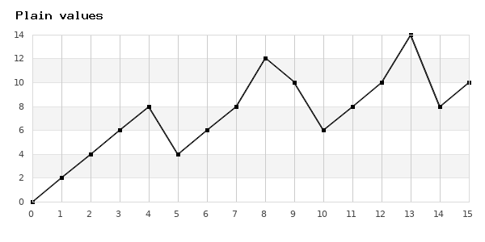
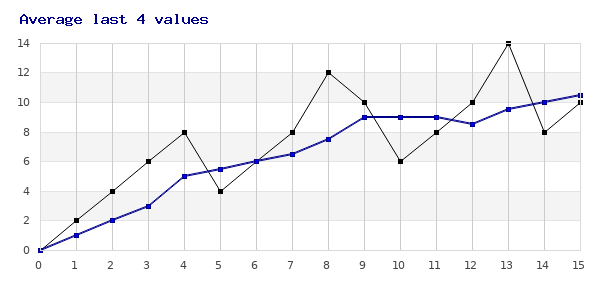
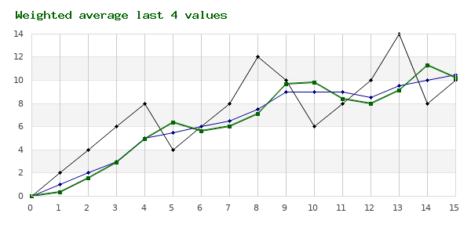
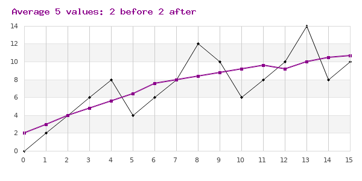
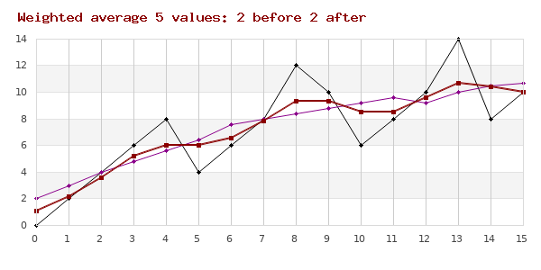

[](https://github.com/dcvn/moving-average/blob/master/LICENSE)
[](https://github.com/dcvn/moving-average/releases/latest)


# Moving Average

Calculate Moving Averages.

This package can help when you need moving averages in your PHP project.

*For example, regular measurements of temperature or weight are not continuous;
to have an idea of direction over time, a moving average is what you need.*

To make numbers visual, I generated some example graphs for this doc.

You can also have a look at the tests for some usage examples.

## Installation

Using composer: `composer require dcvn/moving-average`


## Big or small data: Arrays and Generators

Statistics can have large data sets, and then Generators can help.

MovingAverage supports both Arrays and Generators for both input and output.

```php
<?php
$array = $movingAverage->getCalculatedFromArray($sourceArray);

$generator = $movingAverage->generateFromArray($sourceArray);

$array = $movingAverage->getCalculatedFromGenerator($sourceGenerator);

$generator = $movingAverage->generateFromGenerator($sourceGenerator);
```

There are tests for all 4 variants. Use them to get started!


### Average periods, delays, and weighted average.

The graphs below use this set of values:

```php
<?php $values = [0, 2, 4, 6, 8, 4, 6, 8, 12, 10, 6, 8, 10, 14, 8, 10];
```

### 1. No average

Calculate the "average" over a period of 1,
you will get the exact same set of values:

```php
<?php
$movingAverage = new MovingAverage();
$movingAverage->setPeriod(1);

$data = $movingAverage->getCalculatedFromArray($values);
```

Result values are equal to input values, because of period=1.



### 2. Average over the last n values

Calculate average over the current value and 3 previous values.

```php
<?php
$movingAverage = new MovingAverage();
$movingAverage->setPeriod(4);
```


### 3. Weighted average over the last n values

Calculate average over the current value and 3 previous values, with different importance.
In the example, current value is least important (w=1), previous value most (w=5).

```php
<?php
$movingAverage = new MovingAverage(MovingAverage::WEIGHTED_ARITHMETIC);
$movingAverage->setPeriod(4)
    ->setWeights([2, 3, 5, 1]);
```


### 4. Average over previous n, current, and next n values.

Calculate average over 5 values: previous 2, current, and next 2.

```php
<?php
$movingAverage = new MovingAverage();
$movingAverage->setPeriod(5)
    ->setDelay(2);
```


### 5. Weighted average over previous n, current, and next n values.

Calculate average over 5 values: previous 2, current, and next 2, with different importance.
In the example, the current value is most important (w=5), past less (4, 2), future least (3, 1).

```php
<?php
$movingAverage = new MovingAverage(MovingAverage::WEIGHTED_ARITHMETIC);
$movingAverage->setPeriod(5)
    ->setDelay(2)
    ->setWeights([2, 4, 5, 3, 1]);
```


-----
*Graphs in this doc have been generated using JPGraph*
